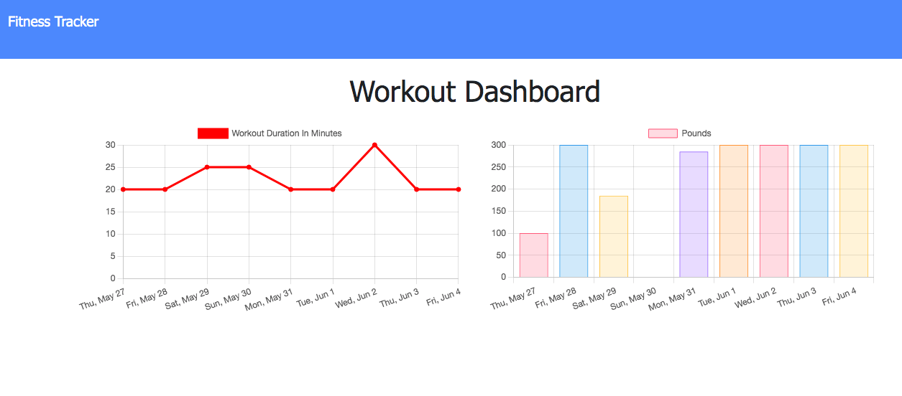
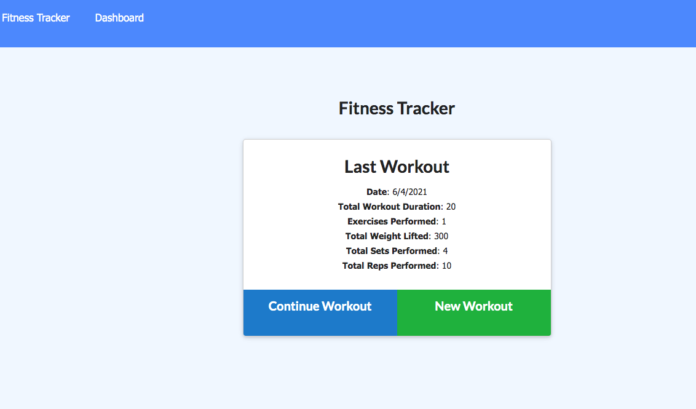

# workout-tracker

# Description

This application allows the user to track their resistance and cardio workouts, including distance, duration, reps, weight, and sets. 

# Usage

- Create new workouts or add to existing workouts.
- Choose workout type from resistance or cardio
- Provide exercise details and save for later or complete workout.
- View stats on the homepage and progress over time in the dashboard.

# Technology

- MongoDB
- Mongoose
- Express.js
- Node.js

# Screenshots

Dashboard:

Homepage:

# Deployed Link
[Workout Tracker](https://workout-tracker-bsk.herokuapp.com/)
